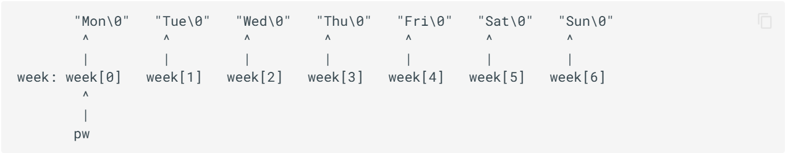
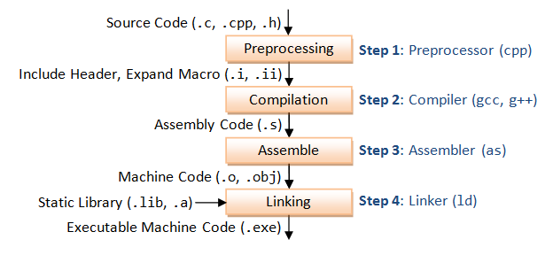

## 常用标准库

- `ctype.h`
  - 声明了几个可以用于**识别和转换字符**的函数.
- `stdio.h`
- `string.h`
- `stdlib.h`
  - 大杂烩, 为了定义和声明那些没有明显归属的宏和函数 (比如指针).
- `math.h`

## 变量与运算

- `unsigned int` 和 `unsigned` 等价, `short int` 和 `short` 等价, `long int` 和 `long` 等价. 
- 变量名是一种**标识符**, 标识符的命名规则是: 由字母, 数字, 下划线, **'$'** 组成, 且不能**以数字开头, 区分大小写**, 不能使用**关键字** (如下).

    
    - 合法的变量名: `printf`, `define`, `_m$` (因为 `printf` 是个库函数, 只要不用它就行, 但显然不推荐这么做).

- `sizeof` 是一个**运算符 (operator)** 而不是函数, 可以获得某个类型或变量在内存中所占据的字节数. 它的结果在**编译时刻**就决定了.
    ```cpp
    int a = 1;
    printf("%d\n", sizeof(a++)); // 4
    printf("%d\n", a);           // 1 (注意 sizeof 是运算符)
    
    int *b;
    printf("%d\n", sizeof(b)); // 8 (取决于 CPU 字长, 现在一般是 64 位)
    ```

- 字面量即一个值的表示方法:
  - ```char a = 0101;```, 0 开头表示**八进制**;
  - ```char b = 0x41;```, 0x 开头表示**十六进制**;
  - ```char c = '\101';```, 单引号里面反斜杠转义, 默认**八进制**;
  - ```char d = '\x41';```, 十六进制.  

- 运算符的优先级, 大体为: **自增/减 > 算术运算 > 位运算 > 赋值运算**.
  
  - ```(x = 4, y = 3)``` 的返回值为 $3$ (逗号表示并列, `y = 3` 的返回值是 $y$).

- 对于 `switch` 语句, `case` 只规定了起点, 而何时退出 `switch` 块则由 `break` 决定. 只要没有遇到 `break`, 则会一直向下执行.
    ```cpp
    int x = 1;
    switch (x) {
        case 1: puts("A");
        default: puts("B"); break;
        case 2: puts("C");  
    }
    /* output:
    A
    B
    */
    ```
## 指针

- ``` cpp
  int a = 1;
  int *p = &a; // & 是取地址运算符
  ```
  指针变量 `p` 的值是 `a` 的地址, `*p` 表示 `p` 指向的变量 (即 `a`), 值为 `a`.

- **指针数组** 与 **数组指针**
  
  ```cpp
  int *a[3];   // 指针(的)数组: a 的数据类型为 int* [3], a 是一个数组, 数组元素是指针
  int (*b)[3]; // 数组(的)指针: b 的数据类型为 int (*)[3], b 是一个指针, 指向一个数组
  int *c[];    // 不存在这样的写法
  int (*d)[];  // 指向一个长度未知的数组
  ```

- **函数指针**

    例如 `int (*func)(int a, int b);`, `func` 就是一个函数指针, 数据类型为 `int (*)(int, int)`.

    C 标准下, 我们既可以用 `add(a, b)` 直接调用函数, 也允许**通过函数指针调用函数**, 例如 `(&add)(a, b)`.
    ```cpp
    #include <stdio.h>
    #include <stdlib.h>

    int _add(int a, int b) { return a + b; }
    int _sub(int a, int b) { return a - b; }
    int _mul(int a, int b) { return a * b; }
    int _div(int a, int b) { return a / b; }

    // 函数到指针的隐式转换, 如这里的 _add 自动转为 &_add
    int (*func[4])(int, int) = {_add, _sub, _mul, _div};

    int main() {
        for (int i = 0; i < 4; i++) {
            // C 标准允许通过函数指针调用函数
            printf("%d\n", func[i](6, 3));
        }
        return 0;
    }
    ```

- `void *` 是合法的指针类型, 指向一个**未知类型**的元素, 可被**隐式转换**为任意其他类型的指针.

- 指针的运算
  - 指针与整数可以加减, 不同于汇编语言, `p + n` 的值为 `p` 加上 `n` 乘以**指针所指向类型的字节数**.
  - 指针与指针**只能相减, 不能相加**, 道理显然.
  - 指针与整数之间不可以相互转换 / 比较. 唯一的特例是可以把 $0$ 赋给指针, 因为 $0$ 被视为空指针 `NULL`.

- **指针常量** 与 **常量指针**
  ```cpp
  int* const p1; // 指针(的)常量: p1 是一个常量, 数据类型为 int*
                 // p1 不可变, 指向的值可变
  const int* p2; // 常量(的)指针: p2 是一个指针, 数据类型为 const int*
                 // p2 可变, 指向的值不可变
  int const* p3; // 同 p2
  ```
  - 数组名是指向其首元素的**指针常量**, 例如 `int a[3]`, `a` 本身不可变, 但对应的 `*a` (也就是 `a[0]`) 可变.

- 作为函数的参数时, 数组名会**隐式转换成指向其首元素的指针**. 但千万注意, **二维数组不能隐式转换成二级指针**.
    ```cpp
    #include <stdio.h>

    void f(char **p) {}

    void test1() { // Wrong
        char var[10][10];          f(var);
    }
    void test2() { // OK
        char *var[10];             f(var);
    }
    void test3() { // OK, void* 可以隐式转换成任何指针类型
        void *var = NULL;          f(var);
    }
    void test4() { // Wrong
        char v[10][10], **var = v; f(var);
    }

    int main() {
        test1(), test2(), test3(), test4();    
        return 0;
    }
    ```

- **空指针** 和 **野指针**

  ```cpp
  int *p1 = NULL; // 空指针
  int *p2 = 10;   // 野指针
  ```

  在程序中, 我们可以使用 `0` 或者 `NULL` 来表示一个**空指针**. 当一个指针是空指针时, 我们无法使用 `*` 来对该指针进行读取, 否则会出现**段错误**, 因此空指针在初始化和异常情况处理时非常重要.

  而如果我们没有给指针一个合理的地址 (并不是一个真正存储某变量的空间, 而是随意乱指), 那么就称为**野指针**. 此时若对其进行取数据操作, 就会出现各种奇怪的错误.

  ```cpp
  #include <string.h>

  char *s, str[10];
  strcpy(s, "hello"); // Wrong, s 没有初始化, 未定义行为 (野指针)
  str = "hello" + 1;  // Wrong, "hello" + 1 是合法的, 但 str 是数组名 (指针常量), 常量不能被修改
  s = *&(str + 1);    // Wrong, (str + 1) 是左值 (lvalue), 不能用 &
  s = str + 1;        // OK
  ```

- `malloc` 和 `free`
  ```cpp
  #include <stdlib.h>
  void *malloc(size_t __size);
  void free(void *__ptr);
  ```

  `malloc` 函数的参数为 `size`, 表示需要申请的空间大小 (字节), 返回值是 `void*` 也就是无类型指针, 这就意味着当我们给一个指针用 `malloc` 申请空间时, 需要在 `malloc` 前面使用其他指针类型强制转换.

  若 `malloc` 申请空间失败, 会返回 `NULL` 空指针, 注意检查.

  由于 `malloc` 申请了一块内存, 当我们不再需要这块内存时, 就需要释放这片空间, 此时使用 `free` 函数.
  
  ```cpp
  #include <stdio.h>
  #include <stdlib.h>

  typedef struct CS* node;

  struct CS {
      int acm, ctf, hpc;
  };

  int main() {
      node p = (node)malloc(sizeof(struct CS));
      p->acm = 100, p->ctf = 92, p->hpc = 95;
      free(p);
      return 0;
  }
  ```

## 多文件编程

- 宏 `#define <名字> <值>`, 最后不用加分号. 在程序开始编译之前, 编译器会将程序中所有设计宏定义的量进行替换.

  - 若宏太长以至于一行放不下, 可以在行末使用 `\` 后换行写.

  - 没有值的宏, 例如 `#define DEBUG` 主要是起标识作用, 同时与 `#ifdef`, `#else`, `#endif` 等配合使用.

- 库函数文件的后缀是 `.h`. 比如创建 `header.h`, 一般会写:

  ```cpp
  #ifndef HEADER_H
  #define HEADER_H
  // 防止之前已经定义过该标识符, 从而出现"重复声明"的错误
  #endif
  ```

  并在之后创建的 `main.c` 的开头写上 ```#include "a.h"```.

## 各种 I/O

- 标准 I/O 比较简单, 文件 I/O 其实我感觉遇到了就查阅文档吧, 没啥好记录的.
  - https://ckc-agc.bowling233.top/programming/archive/23fall/lec3/lec3/#_6

## 一些奇妙的语法特性 (C 尖, 程算)

1.  ```cpp
    char str1[20] = "1234567890123";
    char str1[20] = "1234567890123";
    char str2[20] = "hello";
    strcpy(str1, str2);
    int l = strlen(str1);
    printf("%d %s\n", l, str1);
    for(int i = 0; i < 10; i++)
        printf("%c", str1[i]);
    /* output:
    5 hello
    hello7890
    */
    ```

    因为 `"hello"` 作为字符串字面量, 它其实存储下来的是 `hello'\0'`, 末尾的 `\0` 表示结尾符. 而 `strlen` 是顺序遍历, 找第一个 `\0` 停止, 计算出字符串的长度.

2.  ```cpp
    char *week[]={"Mon", "Tue", "Wed", "Thu", "Fri", "Sat", "Sun"}, **pw=week;
    char c1, c2;
    c1 = (*++pw)[1];
    c2 = *++pw[1];
    printf("%c %c\n", c1, c2);
    /* output:
    u e
    */
    ```

    

3.  ```cpp
    #include <stdio.h>
    #include <stdlib.h>
    #include <string.h>

    void my_strcat(char *s1, char *s2, char *s3) {
        size_t len1 = strlen(s1);
        size_t len2 = strlen(s2);
        s3 = malloc(len1 + len2 + 1);
        memcpy(s3, s1, len1);
        memcpy(s3 + len1, s2, len2);
        s3[len1 + len2] = 0;
        printf("%s\n", s3);
    }

    int main() {
        char s1[] = "I love ";
        char s2[] = "cats!";
        char s3[] = "";
        my_strcat(s1, s2, s3);
        printf("%s\n", s3);
    }
    /* output:
    I love cats!\n\n
    */
    ```

    一定要想明白: 函数传入的参数哪怕是指针, 它也是**形式参数**. 内部 `s3` 被重新 `malloc` 以后就到了一片新的区域, 因此 `main` 函数中的 `s3` 不会被修改.

4.  在 64 位机子上运行如下代码:
  
    ```cpp
    void print(char s[]) {
        printf("%lu\n", sizeof(s));
    }

    int main() {
        char soyo[] = "Hello\0World";
        print(soyo);
        return 0;
    }
    /* output:
    8
    */
    ```

    一定要注意, 往函数传入数组时, 它会被隐式转为指针, 也就是说 `print(char s[])` 和 `print(char *s)` 等价. 在 $64$ 位机子上, 一个指针的值是 $64$ 位地址, 因此字节数为 $8$. 

5.  ```cpp
    #include <stdio.h>
    #include <string.h>
    int main() {
        char arr1[] = "abcd";
        char arr2[] = {'a', 'b', 'c', 'd'};
        printf("%d ", sizeof(arr1));
        printf("%d ", sizeof(arr2));
        printf("%d ", strlen(arr1));
        printf("%d\n", strlen(arr2));
        return 0;
    }
    /* output:
    5 4 4 [indeterminable]
    */
    ```

    注意 `arr1` 的内容为 `abcd\0`, 而 `arr2` 的内容仅为 `abcd`. `sizeof` 是一直找直到访问完所有地址, 而 `strlen` 是找到第一个 `\0`.

## 编译流程

- 每个 C 语言程序都必须包含一个 `main` 函数, 作为程序的入口.
  ```cpp
  int main(void);
  int main(int argc, char *argv[]);
  ```
  `main` 的调用者是操作系统. 操作系统会等待 `main` 的返回值, 用于告知操作系统程序的执行状态 (`0` 表示正常结束).

- 什么是 GCC 编译器？

  - GNU 项目旨在开发一个完全自由的操作系统以及配套的软件. GCC 最早是 GNU C Compiler 的简称, 现在代表 GNU Compiler Collection. 这表明它不是单个程序, 而是一系列编译工具的集合, 包括了 C, C++, Objective-C, Fortran, Ada, Go, D 等语言的前端, 以及汇编器, 链接器等后端, 和这些语言的库文件.

- 编译流程:
  

## 参考文献

- [程设辅学](https://ckc-agc.bowling233.top/programming/24fall/)