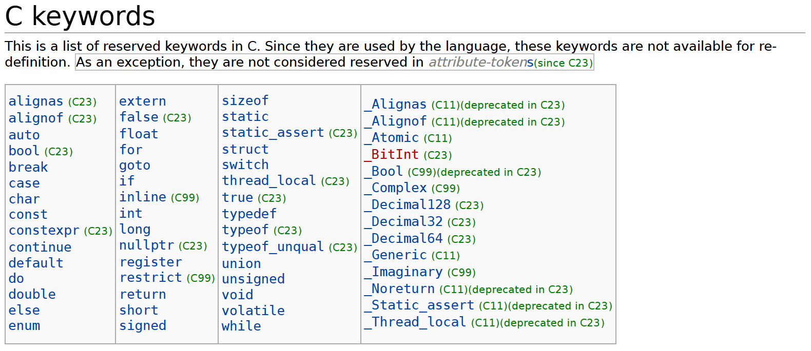
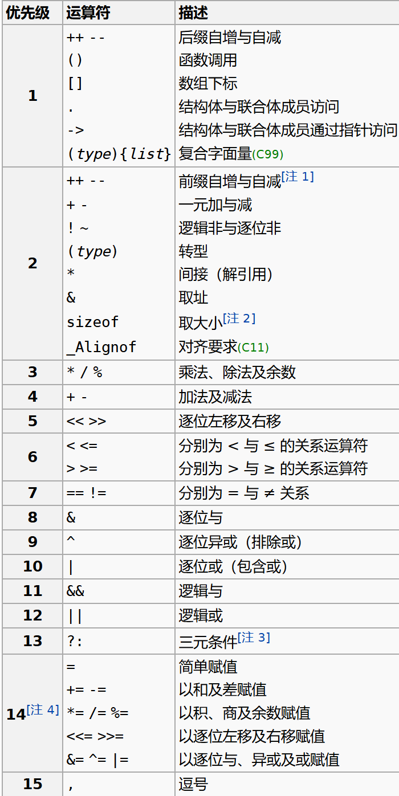

## 变量与运算

- `unsigned int` 和 `unsigned` 等价, `short int` 和 `short` 等价, `long int` 和 `long` 等价. 
- 变量名是一种**标识符**, 标识符的命名规则是: 由字母, 数字, 下划线, **'$'** 组成, 且不能**以数字开头, 区分大小写**, 不能使用**关键字** (如下).

    
    - 合法的变量名: `printf`, `define`, `_m$` (因为 `printf` 是个库函数, 只要不用它就行, 但显然不推荐这么做).

- `sizeof` 是一个**运算符 (operator)** 而不是函数, 可以获得某个类型或变量在内存中所占据的字节数. 它的结果在**编译时刻**就决定了.
    ```cpp
    int a = 1;
    printf("%d\n", sizeof(a++)); // 4
    printf("%d\n", a);           // 1 (注意 sizeof 是运算符)
    
    int *b;
    printf("%d\n", sizeof(b)); // 8 (取决于 CPU 字长, 现在一般是 64 位)
    ```

- 字面量即一个值的表示方法:
  - ```char a = 0101;```, 0 开头表示**八进制**;
  - ```char b = 0x41;```, 0x 开头表示**十六进制**;
  - ```char c = '\101';```, 单引号里面反斜杠转义, 默认**八进制**;
  - ```char d = '\x41';```, 十六进制.  

- 运算符的优先级, 大体为: **自增/减 > 算术运算 > 位运算 > 赋值运算**.
  
  - ```(x = 4, y = 3)``` 的返回值为 $3$ (逗号表示并列, `y = 3` 的返回值是 $y$).

- 对于 `switch` 语句, `case` 只规定了起点, 而何时退出 `switch` 块则由 `break` 决定. 只要没有遇到 `break`, 则会一直向下执行.
    ```cpp
    int x = 1;
    switch (x) {
        case 1: puts("A");
        default: puts("B"); break;
        case 2: puts("C");  
    }
    /* output:
    A
    B
    */
    ```
## 指针

- ``` cpp
  int a = 1;
  int *p = &a; // & 是取地址运算符
  ```
  指针变量 `p` 的值是 `a` 的地址, `*p` 表示 `p` 指向的变量 (即 `a`), 值为 `a`.

- **指针数组** 与 **数组指针**.
  
  ```cpp
  int *a[3];   // 指针(的)数组: a 的数据类型为 int* [3], a 是一个数组, 数组元素是指针
  int (*b)[3]; // 数组(的)指针: b 的数据类型为 int (*)[3], b 是一个指针, 指向一个数组
  int *c[];    // 不存在这样的写法
  int (*d)[];  // 指向一个长度未知的数组
  ```
- `void *` 是合法的指针类型, 指向一个**未知类型**的元素, 可被**隐式转换**为任意其他类型的指针.

- 指针的运算
  - 指针与整数可以加减, 不同于汇编语言, `p + n` 的值为 `p` 加上 `n` 乘以**指针所指向类型的字节数**.
  - 指针与指针**只能相减, 不能相加**, 道理显然.
  - 指针与整数之间不可以相互转换 / 比较. 唯一的特例是可以把 $0$ 赋给指针, 因为 $0$ 被视为空指针 `NULL`.

- **指针常量** 与 **常量指针**.
  ```cpp
  int* const p1; // 指针(的)常量: p1 是一个常量, 数据类型为 int*
                 // p1 不可变, 指向的值可变
  const int* p2; // 常量(的)指针: p2 是一个指针, 数据类型为 const int*
                 // p2 可变, 指向的值不可变
  int const* p3; // 同 p2
  ```
  - 数组名是指向其首元素的**指针常量**, 例如 `int a[3]`, `a` 本身不可变, 但对应的 `*a` (也就是 `a[0]`) 可变.

- 作为函数的参数时, 数组名会**隐式转换成指向其首元素的指针**. 但千万注意, **二维数组不能隐式转换成二级指针**.
    ```cpp
    #include <stdio.h>

    void f(char **p) {}

    void test1() { // Wrong
        char var[10][10];          f(var);
    }
    void test2() { // OK
        char *var[10];             f(var);
    }
    void test3() { // OK, void* 可以隐式转换成任何指针类型
        void *var = NULL;          f(var);
    }
    void test4() { // Wrong
        char v[10][10], **var = v; f(var);
    }

    int main() {
        test1(), test2(), test3(), test4();    
        return 0;
    }
    ```

## reference

- [程设辅学](https://ckc-agc.bowling233.top/programming/24fall/)